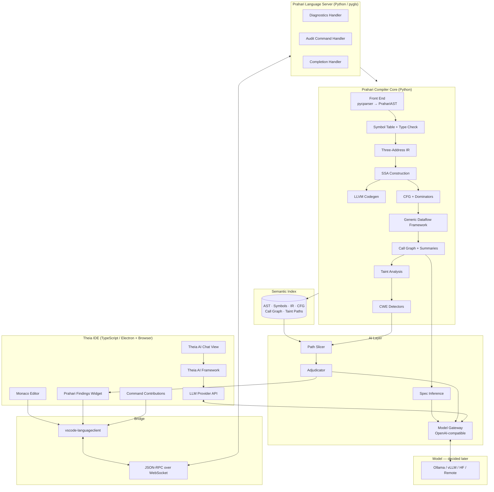
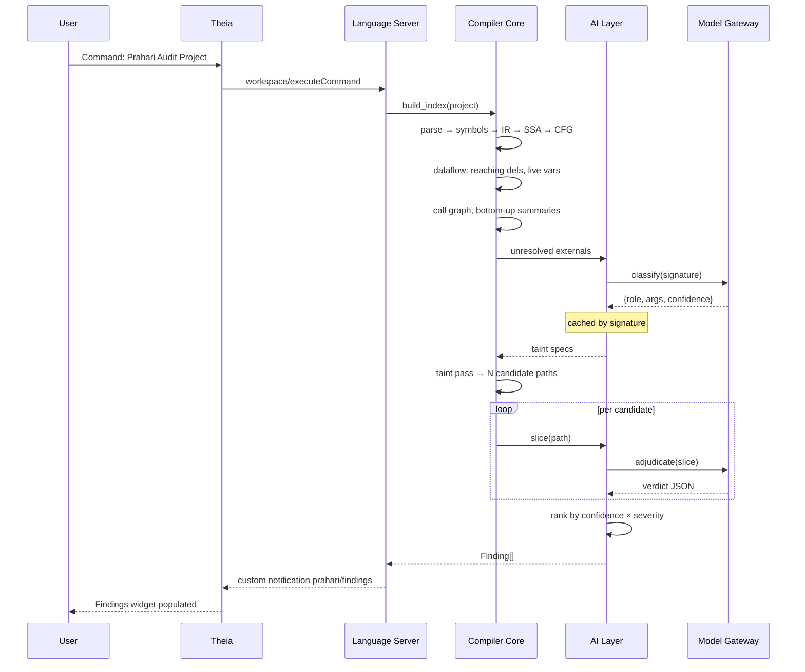

# PRAHARI — Build Plan v2

**Security-Aware Compiler + AI-Native IDE**

Repository selection · Integration procedure · System design · Model-agnostic AI layer

Supersedes Master Document v1.0 §3, §6, §9.

---

## 1. Component Decisions

| Component | Decision | Build vs. Reuse |
|---|---|---|
| IDE shell | **Eclipse Theia** | Reuse (platform) |
| Editor widget | Monaco (inside Theia) | Reuse |
| AI provider abstraction | **Theia AI LLM Providers API** | Reuse |
| C parser | **pycparser** | Reuse |
| IR / SSA / CFG | — | **Build** |
| Dataflow framework | — | **Build** |
| Taint analysis + detectors | — | **Build** |
| Call graph + summaries | — | **Build** |
| Code generation | llvmlite | Reuse binding, build emitter |
| Language server | pygls | Reuse protocol, build handlers |
| Model gateway | — | **Build** (thin) |
| Benchmark corpus | NIST Juliet (SARD) | Reuse |

Everything in the **Build** column is the project. Everything in **Reuse** is scaffolding that would otherwise consume the semester without teaching you anything.

---

## 2. Why Theia, Not a VS Code Fork

Theia is an open-source platform whose primary purpose is building custom tools and IDEs. It reuses VS Code components including the Monaco editor, but it is independently developed with a modular architecture and **is not a fork of VS Code**.

The distinction matters concretely:

| | Code-OSS fork | Theia |
|---|---|---|
| Custom features | Via extension API only, well-defined but limited | Any layer, no forking or patching |
| Architecture changes | Difficult to impossible | Supported by design |
| Branding / custom views | Constrained | First-class |
| License | MIT code, Microsoft-controlled project | Eclipse Public License, vendor-neutral under Eclipse Foundation |
| Desktop + browser | Separate paths | Single technology stack |

Theia also hosts VS Code extensions, supports LSP and DAP, and ships Monaco, so you inherit the entire VS Code look, feel and muscle memory. A demo of Prahari will be indistinguishable from VS Code at a glance, which is exactly the impression you want, while every panel and command remains yours to change.

### 2.1 Theia AI solves the model-agnostic requirement

This is the decisive factor. **Theia AI supports arbitrary AI models via its LLM providers API.** Tool builders can plug in any model including a self-hosted or local LLM, and models can be assigned per use case — one for code completion, another for chat, another for the audit agent. Users can configure additional LLMs at runtime, so models released after your build still work.

You therefore do not have to design a provider abstraction, commit to a model now, or rewrite anything when you switch. **Leave the model slot empty and decide in week 9.**

---

## 3. Repository Inventory

### 3.1 Direct dependencies — code you ship

| Repo | Role | License |
|---|---|---|
| `eclipse-theia/theia` | IDE platform, Monaco, LSP client, AI framework | EPL-2.0 |
| `eliben/pycparser` | C99 → AST, pure Python | BSD |
| `openlawlibrary/pygls` | Python LSP server framework | Apache-2.0 |
| `numba/llvmlite` | LLVM IR construction and JIT | BSD |
| `networkx/networkx` | CFG, dominator tree, call graph algorithms | BSD |

### 3.2 Reference implementations — code you read, not import

| Repo | What to extract |
|---|---|
| `python-security/pyt` | **Primary reference.** CFG construction, fixpoint iteration, dataflow analysis, def-use and use-def chains, taint sources/sinks/sanitizers, detectors for command injection, SQL injection, XSS, directory traversal. Unmaintained since 2020, which does not matter for reading. Ships READMEs in most directories plus the original Master's thesis and slides. |
| `ShivamSarodia/ShivyC` | Symbol table design, type checking, IL structure, x86-64 codegen. C11 subset in pure Python, ~1,041 stars, MIT. |
| `Enna1/LLVM-Clang-Examples` | `taint-propagation/` — flow-sensitive, field- and context-insensitive taint propagation via classic dataflow. `dataflow-points-to-analysis/` for the aliasing problem you are scoping out. |
| `rui314/chibicc` | Incremental compiler construction, commit by commit. 11.7k stars. Reading material. |
| `iris-sast/iris` | LLM taint-specification inference prompts. Your Mode B spec inference. |
| `iris-sast/cwe-bench-java` | Benchmark harness design — fetch, build, analyze scripts. |
| `SVF-tools/SVF` | Interprocedural summary design. See also SVF-Teaching. |
| `nlsandler/write_a_c_compiler` | Front-end validation test suite. |

### 3.3 Rejected, with reasons

| Repo | Why not |
|---|---|
| Code-OSS / VS Code | Extension API too constrained for custom analysis views |
| CodeMirror 6 | Editor only, no IDE shell, no extension model, no AI framework |
| SVF | C++/LLVM, months to build on, overkill |
| Joern | Scala/JVM, excellent but it *is* the analysis — using it means you didn't build one |
| ShivyC as base | Complete compiler; forking it leaves you with nothing to write |

---

## 4. Integration Procedure

### Phase 0 — Scaffold (Week 0, 2–3 days)

```bash
# Monorepo
mkdir prahari && cd prahari && git init

# --- IDE ---
npm install -g yo generator-theia-extension
yo theia-extension            # choose: "Hello World"
# rename generated extension → prahari-ide

# --- Compiler ---
mkdir -p compiler && cd compiler
python -m venv .venv && source .venv/bin/activate
pip install pycparser pygls llvmlite networkx pytest
```

**Checkpoint:** `yarn start:browser` opens a Theia window in the browser with your extension's command visible in the palette. Do not proceed until this works. Theia's build is the single most likely place to lose two days.

### Phase 1 — Front end via pycparser (Week 1)

pycparser is a parser, not a compiler. You take its AST and nothing else.

```python
from pycparser import c_parser, c_ast

class PrahariFrontend:
    def parse(self, source: str) -> c_ast.FileAST:
        return c_parser.CParser().parse(source)
```

**Do not use pycparser's own visitor for analysis.** Write your own lowering pass that converts `c_ast` nodes into your IR. This keeps the interesting work yours and makes the boundary between reused and original code auditable for academic honesty.

Three practical notes:

- pycparser does not preprocess. Run `gcc -E` first, or use its `fake_libc_include` headers. Juliet cases need this.
- Write an adapter (`frontend/adapter.py`) that maps `c_ast` to your own `PrahariAST` node classes. If you later have to hand-write a parser, only this file changes.
- Keep source positions. Every IR instruction must carry `(file, line, col)` or the findings panel cannot navigate.

### Phase 2 — Compiler core (Weeks 2–6)

Entirely yours. Order: symbol table → type checker → three-address IR → CFG → SSA → dataflow framework.

Read PyT's `cfg/` and `analysis/` directories before writing week 4. Read ShivyC's `il_gen.py` and symbol table before week 2.

### Phase 3 — Analysis (Weeks 7–8)

Taint lattice, transfer functions, detectors, call graph summaries. Reference: PyT's trigger-word and vulnerability modules, plus the LLVM taint-propagation pass for transfer function shape.

### Phase 4 — LSP bridge (Week 9)

```python
from pygls.server import LanguageServer

server = LanguageServer("prahari", "v1")

@server.feature("textDocument/didSave")
def on_save(ls, params): ...          # type errors → diagnostics

@server.command("prahari.audit")
def audit(ls, args): ...              # full pipeline → findings
```

Theia's LSP integration reuses Microsoft's `vscode-languageclient`, with `vscode-ws-jsonrpc` handling JSON-RPC over WebSocket and `monaco-languageclient` connecting Monaco to language servers. You configure, you don't implement.

### Phase 5 — IDE surfaces (Week 10)

Three Theia contributions:

1. `PrahariFindingsWidget` — the path-trace tree view
2. `AuditCommandContribution` — "Prahari: Audit Project" in the command palette
3. `PrahariAgent` — a Theia AI agent for the assistant

### Phase 6 — Model binding (Week 11, deferred by design)

Pick a model. Configure it in Theia AI preferences. No code changes.

---

## 5. Updated Architecture



### 5.1 The two AI paths, one gateway

| Path | Trigger | Route |
|---|---|---|
| **Assistant** (Mode A) | User types / asks | Theia AI → LLM Provider API → Model Gateway |
| **Audit** (Mode B) | User runs audit | Compiler → Adjudicator → Model Gateway |

Both terminate at the **Model Gateway**, a thin Python service exposing an OpenAI-compatible `/v1/chat/completions` endpoint. Consequences:

- One place configures the model. Change a config value, both paths switch.
- Ollama, vLLM, llama.cpp and most hosted APIs already speak this protocol, so the gateway is mostly a pass-through with caching and logging.
- Theia AI connects to it as a custom OpenAI-compatible provider, which it supports natively.
- **The model choice is a runtime configuration value, not an architectural commitment.**

---

## 6. System Design

### 6.1 Semantic Index

The contract between compiler and AI. Serialized to Postgres, cached per project revision hash.

```python
@dataclass
class SemanticIndex:
    revision:    str                      # content hash
    ast:         PrahariAST
    symbols:     SymbolTable
    ir:          dict[str, list[Instr]]   # function → SSA instructions
    cfg:         dict[str, CFG]
    callgraph:   CallGraph
    summaries:   dict[str, TaintSummary]
    diagnostics: list[Diagnostic]
    taint_paths: list[TaintPath]
```

### 6.2 Core types

```python
@dataclass
class TaintPath:
    cwe:        str                # "CWE-78"
    source:     Location
    sink:       Location
    steps:      list[PropagationStep]
    guards:     list[Guard]        # conditionals on path
    confidence: float | None       # None until adjudicated

@dataclass
class TaintSummary:
    function:   str
    param_flows: dict[int, set[int | Literal["RETURN", "SINK"]]]
    sanitizes:  set[int]
    reaches_sink: dict[int, str]

@dataclass
class Finding:
    path:            TaintPath
    exploitable:     bool
    reason:          str
    missing_control: str
    severity:        Severity
    adjudicator:     str           # model identifier, for reproducibility
```

`Finding.adjudicator` exists so every result in your evaluation table is traceable to the model that produced it. Without it the ablation is not reproducible.

### 6.3 Model Gateway interface

```python
class ModelGateway(Protocol):
    async def complete(
        self,
        system: str,
        user: str,
        schema: dict | None = None,   # JSON schema for structured output
        temperature: float = 0.0,
    ) -> dict: ...
```

Implementations: `OllamaGateway`, `OpenAICompatGateway`, `HuggingFaceGateway`, `NullGateway`.

**`NullGateway` is not optional.** It returns `{"exploitable": true, "confidence": 0.5}` for every call. It gives you (a) a working pipeline before any model exists, (b) the control row in your ablation, (c) a deterministic CI test path.

### 6.4 Audit sequence



Progress is reported via LSP `$/progress` so the Theia status bar shows live phase updates. Audits on real projects take minutes; a frozen UI reads as a crash.

### 6.5 Caching

| Cache | Key | Invalidated by |
|---|---|---|
| Semantic Index | project content hash | any source change |
| Taint specs | function signature | never (append-only) |
| Adjudications | hash(slice + model id) | model change |

The spec cache is what keeps audit latency flat as projects grow. Each library function is classified once, ever.

---

## 7. Repository Structure

```
prahari/
├── ide/                                  # Theia — TypeScript
│   ├── prahari-ide/
│   │   ├── src/
│   │   │   ├── browser/
│   │   │   │   ├── prahari-frontend-module.ts
│   │   │   │   ├── findings-widget.tsx        # path-trace tree
│   │   │   │   ├── findings-contribution.ts
│   │   │   │   ├── audit-command.ts
│   │   │   │   ├── severity-decorator.ts      # editor gutter marks
│   │   │   │   └── ai/
│   │   │   │       ├── prahari-agent.ts         # Theia AI agent
│   │   │   │       └── prompt-templates.ts
│   │   │   ├── node/
│   │   │   │   ├── prahari-backend-module.ts
│   │   │   │   └── language-server-contribution.ts
│   │   │   └── common/
│   │   │       └── protocol.ts                # shared types
│   │   └── package.json
│   ├── browser-app/
│   ├── electron-app/
│   └── package.json
│
├── compiler/                             # Python
│   ├── prahari/
│   │   ├── frontend/
│   │   │   ├── adapter.py                # pycparser → PrahariAST
│   │   │   ├── ast_nodes.py
│   │   │   └── preprocess.py
│   │   ├── semantic/
│   │   │   ├── symbol_table.py
│   │   │   ├── types.py
│   │   │   └── checker.py
│   │   ├── ir/
│   │   │   ├── instructions.py           # three-address
│   │   │   ├── lowering.py               # AST → IR
│   │   │   ├── cfg.py                    # blocks, edges, dominators
│   │   │   └── ssa.py                    # dominance frontiers, phi
│   │   ├── analysis/
│   │   │   ├── lattice.py
│   │   │   ├── framework.py              # generic worklist solver
│   │   │   ├── reaching_defs.py
│   │   │   ├── live_vars.py
│   │   │   ├── taint.py
│   │   │   ├── callgraph.py
│   │   │   ├── summaries.py
│   │   │   └── detectors/
│   │   │       ├── base.py
│   │   │       ├── cwe_120_overflow.py
│   │   │       ├── cwe_134_format.py
│   │   │       ├── cwe_78_command.py
│   │   │       ├── cwe_476_nullderef.py
│   │   │       ├── cwe_416_uaf.py
│   │   │       └── cwe_401_leak.py
│   │   ├── codegen/
│   │   │   └── llvm_emitter.py
│   │   ├── index.py                      # SemanticIndex
│   │   └── types.py                      # TaintPath, Finding, ...
│   ├── ai/
│   │   ├── gateway/
│   │   │   ├── base.py                   # ModelGateway protocol
│   │   │   ├── ollama.py
│   │   │   ├── openai_compat.py
│   │   │   ├── huggingface.py
│   │   │   └── null.py                   # control / CI
│   │   ├── slicer.py
│   │   ├── spec_inference.py
│   │   ├── adjudicator.py
│   │   ├── prompts/
│   │   │   ├── spec_inference.j2
│   │   │   └── adjudication.j2
│   │   └── cache.py
│   ├── server/
│   │   ├── lsp_server.py                 # pygls
│   │   ├── handlers.py
│   │   └── progress.py
│   ├── gateway_service.py                # FastAPI, OpenAI-compatible
│   └── pyproject.toml
│
├── eval/
│   ├── juliet/
│   │   ├── fetch.py
│   │   ├── filter.py                     # parseable subset + exclusion log
│   │   └── harness.py
│   ├── ablation.py                       # config matrix runner
│   ├── variance.py                       # N runs, verdict spread
│   └── report.py
│
├── tests/
├── docker/
├── docs/
│   ├── ARCHITECTURE.md
│   ├── ATTRIBUTION.md                    # required, see §9
│   └── RESULTS.md
└── README.md
```

---

## 8. Revised Timeline

| Week | Deliverable | Gate |
|---|---|---|
| 0 | Theia scaffold + Python env | `yarn start:browser` opens custom IDE |
| 1 | pycparser adapter → PrahariAST | Juliet subset parses; exclusions logged |
| 2 | Symbol table + type checker | Rejects type errors |
| 3 | Three-address IR lowering | IR dump for all test programs |
| 4 | CFG + dominator tree | Correct on nested loops |
| 5 | SSA construction | Phi placement verified — **fallback decision point** |
| 6 | Dataflow framework + reaching defs + live vars | Framework validated by classical analyses |
| 7 | Taint lattice + intraprocedural + 3 detectors | First true positives on Juliet |
| 8 | Call graph + summaries + 3 more detectors | Cross-function findings |
| 9 | LSP server + Theia wiring | Diagnostics appear in Monaco |
| 10 | Findings widget + audit command | End-to-end with `NullGateway` |
| 11 | Model selection + gateway + prompts | Real adjudication |
| 12 | Ablation runs, LLVM codegen, report | Results table populated |

Two structural changes from v1:

**Week 10 completes end-to-end with `NullGateway`.** The system demos without any model. Model integration in week 11 is an upgrade, not a dependency. If week 11 collapses entirely, you still have a working compiler, a working IDE, a working taint analysis and four of six ablation rows.

**Week 5 keeps the SSA fallback gate.** If phi placement via dominance frontiers is not working by Friday of week 5, switch to non-SSA three-address code with explicit kill sets and move on.

---

## 9. Licensing and Attribution

You are combining EPL-2.0 (Theia) with BSD (pycparser, llvmlite, networkx) and Apache-2.0 (pygls). All compatible for a project of this kind, but:

**Write `docs/ATTRIBUTION.md` in week 0, not week 12.** For each reused repo: name, license, what you took, what you wrote. For each reference repo: what you read and which of your modules it influenced.

This is partly legal hygiene and mostly academic protection. An examiner who discovers unattributed reuse at viva assumes the worst about everything else. An examiner handed a precise attribution document assumes competence. The document costs an hour and is the cheapest risk mitigation in the project.

State the boundary explicitly in your report: **parsing is reused, everything downstream of the AST is original.**

---

## 10. Risk Register (Revised)

| Risk | Severity | Mitigation |
|---|---|---|
| Theia build environment fails | **High** | Resolve in week 0 before anything else. Node version pinned, `yarn` not `npm`, Docker fallback image |
| pycparser rejected by course rules | High | **Confirm with instructor before week 1.** Fallback: hand-written lexer/parser for C subset, smaller Juliet set |
| SSA construction overruns | High | Fallback gate end of week 5 |
| Pointer aliasing destroys precision | High | Restrict analyzed subset, document as scope, cite points-to analysis as future work |
| TypeScript/Python split doubles context cost | Medium | LSP boundary is narrow and stable; freeze `protocol.ts` in week 9 |
| Model unavailable or too weak | Medium | `NullGateway` keeps system functional; model is week 11, not week 1 |
| Juliet exclusion rate embarrassingly high | Medium | Report it as a result with reasons; 150 cases suffices |
| Theia AI API changes | Low | Pin Theia version in week 0, do not upgrade mid-project |

---

## 11. Immediate Actions

1. **Ask your instructor** whether pycparser is permissible. This gates week 1 and changes two weeks of plan.
2. **Scaffold Theia today.** If the build fights you, you need to know now, not in week 9.
3. **Read PyT's thesis and directory READMEs.** It is the closest published description of what you are building, at exactly the right level of depth.
4. **Freeze the reused-vs-original boundary in writing** before any code exists.

Do not select a model. That decision is correctly deferred to week 11 and the architecture is built to keep it cheap.
