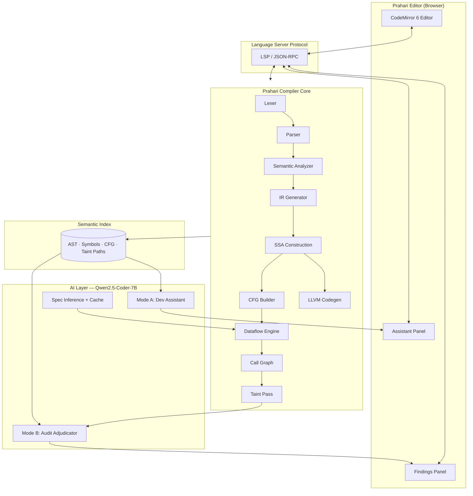
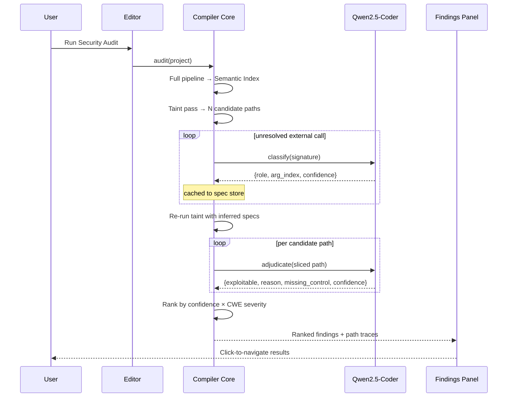

# PRAHARI

**A Security-Aware Compiler with Integrated AI-Assisted Development Environment**

Master Project Document · Version 1.0

---

## 1. Project Topic

> **Prahari** is a compiler for a C-subset language whose intermediate representations are reused as the context substrate for two AI-assisted capabilities: an in-editor coding assistant during development, and a whole-project security audit pass invoked on demand at the end of a development session.

The central thesis is one sentence long:

**A compiler already computes everything an AI assistant needs to be accurate. Most AI tooling throws that away and re-derives it badly from raw text.**

Cursor, Copilot and every embedding-based assistant operate on token streams and vector similarity. They do not know that `buf` on line 40 is the same storage as `dst` on line 12, because establishing that requires symbol resolution, SSA renaming and interprocedural dataflow. A compiler computes exactly that as a byproduct of compilation. Prahari exposes it.

### 1.1 What makes this a compiler project

Every AI feature in the system is downstream of a classical compiler phase. Remove the language model and a complete, working compiler remains. Remove the compiler and the language model is a chatbot with a 99% false positive rate.

| Compiler artifact | Consumed by |
|---|---|
| Token stream | Editor syntax highlighting |
| AST | Structural pattern detectors, assistant context |
| Symbol table | Identifier resolution, scope-aware completion |
| Three-address IR (SSA) | Normalized analysis surface |
| Control flow graph | Path feasibility, unreachable-code detection |
| Dataflow framework | Reaching definitions, live variables, **taint propagation** |
| Call graph | Interprocedural taint summaries |
| Taint paths | AI audit adjudication |

---

## 2. Problem Statement

Static application security testing has a precision problem, not a detection problem, and it long predates AI. A 2018 Google study in *Communications of the ACM* identified false positives and absence of actionable guidance as the primary reasons developers abandon static analysis tools.

Language models have not fixed this. Applied zero-shot to source files:

| Model | Benchmark | False Positive Rate |
|---|---|---|
| Llama 3.1-8B-Instruct | OWASP Benchmark v1.2 | 0.994 |
| Qwen3-8B | OWASP Benchmark v1.2 | 0.763 |

Llama identified 8 safe samples correctly out of 1,325. A detector that flags nearly everything is not a detector.

Neurosymbolic systems that pair a language model with real program analysis perform far better. IRIS (ICLR 2025) combines LLM-inferred taint specifications with CodeQL and detects 55 of 120 vulnerabilities on CWE-Bench-Java where CodeQL alone detects 27. Its 2026 successor vEcho reaches 65% detection while reducing false positive rate from 84.82% to 59.78%.

**Prahari adopts that architecture and asks a narrower question:** does an ordinary compiler's own dataflow machinery, built from scratch, provide enough structure to make a small quantized open model useful as a security adjudicator?

### 2.1 Scope boundary

| In scope | Out of scope |
|---|---|
| C-subset source language | Full ISO C |
| Six CWE classes | Comprehensive CWE coverage |
| Intra- and interprocedural taint | Full alias / points-to analysis |
| On-demand full-project audit | Incremental / real-time scanning |
| Local quantized open model | Frontier API models |
| Web-based editor over LSP | Production IDE |

Pointer arithmetic, function pointers, `goto`, unions and variadic user functions are excluded from the grammar. Precise taint tracking through arbitrary aliasing is an unsolved research problem; restricting the language is the honest engineering response.

---

## 3. System Architecture

### 3.1 High-level



### 3.2 The unifying design decision

The **Semantic Index** is the contract between the compiler and the AI layer. It is a persistent, queryable snapshot of the program produced by compilation:

```
SemanticIndex
├── ast                 : AST root + source position map
├── symbols             : scope tree, declarations, types
├── ir                  : three-address instructions in SSA form
├── cfg                 : basic blocks, edges, dominator tree
├── callgraph           : caller/callee edges, per-function taint summaries
├── diagnostics         : type errors, warnings
└── taint_paths         : [source → propagation steps → sink] traces
```

Both AI modes read from this single structure. That is the architectural point of the project: **one compiler front end, two consumers.**

---

## 4. The Compiler

### 4.1 Source language (MiniC)

```
program        → declaration*
declaration    → funcDecl | varDecl
funcDecl       → type IDENT "(" params? ")" block
varDecl        → type IDENT ( "[" NUMBER "]" )? ( "=" expr )? ";"
type           → "int" | "char" | "void" | type "*"
block          → "{" statement* "}"
statement      → exprStmt | ifStmt | whileStmt | forStmt
               | returnStmt | block | varDecl
expr           → assignment
assignment     → IDENT ( "[" expr "]" )? "=" assignment | logicalOr
logicalOr      → logicalAnd ( "||" logicalAnd )*
logicalAnd     → equality ( "&&" equality )*
equality       → comparison ( ( "==" | "!=" ) comparison )*
comparison     → term ( ( "<" | ">" | "<=" | ">=" ) term )*
term           → factor ( ( "+" | "-" ) factor )*
factor         → unary ( ( "*" | "/" | "%" ) unary )*
unary          → ( "!" | "-" | "*" | "&" ) unary | call
call           → primary ( "(" args? ")" | "[" expr "]" )*
primary        → NUMBER | STRING | CHAR | IDENT | "(" expr ")"
```

### 4.2 Pipeline

| # | Phase | Implementation | Output |
|---|---|---|---|
| 1 | Lexical analysis | Hand-written DFA scanner | Token stream with positions |
| 2 | Parsing | Recursive descent, Pratt for expressions | AST |
| 3 | Semantic analysis | Scoped symbol table, type checker | Annotated AST, symbol table |
| 4 | IR generation | AST lowering | Three-address code |
| 5 | SSA construction | Dominance frontiers, phi insertion | SSA-form IR |
| 6 | CFG construction | Basic block partitioning | CFG + dominator tree |
| 7 | Dataflow analysis | Generic worklist solver | Reaching defs, live vars, taint |
| 8 | Call graph | Static resolution | Call graph + taint summaries |
| 9 | Code generation | `llvmlite` emission | LLVM IR → native |

### 4.3 The dataflow framework

The framework is written **once**, parameterized, and instantiated three times. This is the core reusability argument of the project.

```python
class DataflowAnalysis:
    direction: Direction          # FORWARD | BACKWARD
    lattice: Lattice              # domain, top, bottom, join
    def transfer(self, inst, in_state) -> State: ...
    def boundary(self) -> State: ...

def solve(cfg, analysis):
    worklist = deque(cfg.blocks)
    state = {b: analysis.lattice.bottom for b in cfg.blocks}
    while worklist:
        b = worklist.popleft()
        incoming = analysis.lattice.join(
            state[p] for p in preds(b, analysis.direction)
        )
        out = incoming
        for inst in instructions(b, analysis.direction):
            out = analysis.transfer(inst, out)
        if out != state[b]:
            state[b] = out
            worklist.extend(succs(b, analysis.direction))
    return state
```

| Instantiation | Direction | Lattice | Meet | Purpose |
|---|---|---|---|---|
| Reaching definitions | Forward | Set of definitions | Union | Course requirement, validates framework |
| Live variables | Backward | Set of variables | Union | Course requirement, dead-code elimination |
| **Taint propagation** | Forward | Set of tainted SSA values | Union | **Security detector** |

### 4.4 Taint transfer functions

```
TAINT(x)                       where x ∈ Sources          → {x}
x := y                         y tainted                  → taint(x)
x := y ⊕ z                     y or z tainted             → taint(x)
x := *p                        p tainted                  → taint(x)
x := f(a₁..aₙ)                 aᵢ tainted ∧ summary(f)    → per summary
x := sanitize(y)               any y                      → untaint(x)
if (bounds_check(y)) { ... }   within true branch         → untaint(y)
sink(x)                        x tainted                  → EMIT FINDING
```

Interprocedural analysis computes a **summary per function**: for each formal parameter, whether taint on it reaches the return value, reaches a sink, or is sanitized. Summaries are computed bottom-up over the call graph's reverse topological order. Recursive cycles are handled by iterating to fixpoint with an optimistic initial assumption.

### 4.5 Detectors

| CWE | Name | Detection strategy |
|---|---|---|
| 120 | Buffer overflow | Tainted or unbounded length into `strcpy`, `gets`, `sprintf` |
| 134 | Format string | Tainted value in format argument position of `printf` family |
| 78 | OS command injection | Tainted value reaching `system`, `popen`, `exec*` |
| 476 | NULL dereference | Dereference on path where allocation return is unchecked |
| 416 | Use after free | Dereference of SSA value reachable from a `free` |
| 401 | Memory leak | `malloc` result with no `free` on any path to function exit |

CWE-476, 416 and 401 use a **state-machine lattice** (`UNALLOCATED → ALLOCATED → FREED → ERROR`) rather than the taint lattice, instantiated through the same generic solver.

---

## 5. The AI Layer

**Model:** Qwen2.5-Coder-7B-Instruct, 4-bit quantized, served locally via Ollama.
Everything runs on-device. No source code leaves the machine. This is not incidental — it is the deployment argument that makes the system viable for an enterprise that will not send proprietary code to a third-party API.

### 5.1 Mode A — Development Assistant

Active while the user writes. The model never guesses at program structure; the compiler supplies it.

| Feature | Compiler artifact supplied as context |
|---|---|
| Context-aware completion | Symbol table: in-scope identifiers with types |
| Error explanation | Type checker diagnostic + relevant AST subtree |
| Inline fix suggestion | Diagnostic + enclosing function IR |
| "Explain this function" | CFG summary + call graph neighbours |
| Dead code hint | Live variable analysis result |
| Security lint (light) | AST pattern hits only, not full taint |

The distinction from mainstream assistants: completion candidates are **filtered against the symbol table before generation**, so the model cannot suggest an identifier that is not in scope. Hallucinated symbols become structurally impossible rather than statistically unlikely.

### 5.2 Mode B — Audit Adjudicator

Invoked explicitly by the user. The compiler runs the full pipeline, the taint pass emits candidate paths, and only then does the model engage.

**The model is never the detector.** It adjudicates pre-narrowed candidates.



### 5.3 Taint specification inference

Static taint analysis fails on library functions whose bodies it cannot see. Conventionally a human writes these specifications by hand. IRIS demonstrated that a language model can infer them instead, removing the manual-specification bottleneck that limits classical taint tools.

When the analyzer encounters an unresolved external call:

```json
{
  "signature": "char *fgets(char *s, int size, FILE *stream)",
  "role": "SOURCE",
  "tainted_outputs": [0],
  "sanitizes": [],
  "confidence": 0.94
}
```

Results are cached in a persistent spec store. The same function is classified once per project lifetime, so audit latency does not scale with call volume.

### 5.4 Adjudication prompt structure

The model receives a **slice**, never a file. The path extracted from the CPG-equivalent structures is typically 30–60 lines where the enclosing functions total thousands. This is the mechanism that makes a 7B model viable: LLMxCPG reports that graph-guided slicing reduces code size by 67.84–90.93% while preserving vulnerability-relevant context.

```
SYSTEM: You are a security analyst. Given a dataflow path from an
        untrusted source to a security-sensitive sink, determine
        whether the path is exploitable. Respond only in JSON.

CANDIDATE: CWE-78 (OS Command Injection)

PATH:
  [SOURCE]  line 12  char *input = argv[1];
  [PROP]    line 18  strcpy(cmd_buf, input);
  [PROP]    line 23  build_command(cmd_buf, out);
  [SINK]    line 40  system(out);

SUMMARY build_command(char*, char*):
  param 0 → param 1 : PROPAGATES, no sanitization

GUARDS ON PATH: none

RESPOND:
{"exploitable": bool, "reason": str,
 "missing_control": str, "confidence": float}
```

### 5.5 Why not ask the model directly

This question will be asked in evaluation. The answer is the OWASP Benchmark numbers in §2: a 0.994 false positive rate for direct file-level querying. The compiler's role is to reduce the model's task from *search* to *verification* — from "find bugs in 10,000 lines" to "does anything sanitize this value across these four steps." The second question is one a 7B model can answer.

---

## 6. The Editor

A thin client. Approximately 15% of total effort; the compiler and analysis are the project.

| Component | Technology |
|---|---|
| Editor surface | CodeMirror 6 |
| Shell | Next.js + TypeScript |
| Transport | LSP over WebSocket (JSON-RPC 2.0) |
| Backend | FastAPI wrapping the compiler |
| Persistence | PostgreSQL — projects, findings, spec cache |

**Syntax highlighting is driven by the compiler's own lexer**, streamed to the client. The editor and the compiler share one tokenizer, so highlighting can never disagree with parsing.

### 6.1 Findings panel

The demo centrepiece is the path trace visualization:

```
⚠ CWE-78 · OS Command Injection · HIGH · confidence 0.91

  ● SOURCE      main.c:12    char *input = argv[1];
  │                          user-controlled input enters program
  ▼
  ○ PROPAGATE   main.c:18    strcpy(cmd_buf, input);
  │                          unbounded copy, taint preserved
  ▼
  ○ PROPAGATE   util.c:23    build_command(cmd_buf, out);
  │                          summary: param0 → param1, no sanitizer
  ▼
  ● SINK        main.c:40    system(out);
                             tainted value reaches shell execution

  MISSING CONTROL  input validation or allowlist before system()
  SUGGESTED FIX    replace system() with execve() and argument array
```

Each row is clickable and navigates to the source location.

---

## 7. Evaluation

### 7.1 Dataset

**NIST Juliet Test Suite (SARD)** — synthetic C/C++, compilable, labeled, with paired vulnerable and safe variants of each test case. The pairing is essential: it yields both detection rate and false positive rate from a single corpus, which most student projects fail to report.

Because MiniC is a C subset, cases must be filtered to those that parse. **Report the exclusion count and reason explicitly.** A quantified limitation strengthens a report; an unstated one invalidates it. Target 150–300 usable cases across the six CWE classes.

### 7.2 Ablation

The report's central result. Each row adds exactly one component.

| Configuration | TP | FP | FN | Detection Rate | FPR | Precision |
|---|---|---|---|---|---|---|
| AST pattern matching only | | | | | | |
| + intraprocedural taint | | | | | | |
| + interprocedural summaries | | | | | | |
| + LLM-inferred specifications | | | | | | |
| + LLM adjudication (full Prahari) | | | | | | |
| *Control:* model on raw files | | | | | | |

Two findings are publishable if they hold:

1. **LLM-inferred specifications increase recall** over hand-written ones, by resolving library functions no human spec-writer enumerated.
2. **LLM adjudication reduces FPR** without a proportional recall loss, because the model is verifying narrow slices rather than searching files.

The control row exists to quantify what the compiler contributes. Published reference points: vEcho at 65% detection / 59.78% FPR, IRIS at 45.83% / 84.82%. Those use frontier models on real-world Java; Prahari uses a quantized 7B model on synthetic C. **Do not claim comparability.** Cite them as context for the problem's difficulty, not as competitors.

### 7.3 Secondary metrics

- Audit wall-clock time vs. project LOC
- Peak memory during CPG/SSA construction
- Spec cache hit rate across runs
- Adjudication determinism: same input, N runs, verdict variance

The last one matters. LLM vulnerability reasoning is documented as non-deterministic and sensitive to superficial changes such as variable naming. Report the variance rather than a single best run.

---

## 8. Technology Stack

| Layer | Choice | Rationale |
|---|---|---|
| Compiler | Python 3.11 | Rapid iteration; `llvmlite` binding |
| Lexer / Parser | Hand-written | Demonstrates competence over generators |
| Codegen | `llvmlite` | Real backend, not a toy VM |
| Graph structures | `networkx` | CFG, dominators, call graph |
| Model runtime | Ollama | Local, quantized, zero-config |
| Model | Qwen2.5-Coder-7B-Instruct Q4 | Strongest open code model at this size |
| API | FastAPI | Existing familiarity |
| Editor | CodeMirror 6 + Next.js | Existing familiarity |
| Database | PostgreSQL | Findings, spec cache, scan history |
| Benchmark | NIST Juliet (SARD) | Labeled, paired, compilable |

---

## 9. Module Breakdown

```
prahari/
├── compiler/
│   ├── lexer.py                 # DFA scanner, token stream
│   ├── parser.py                # recursive descent + Pratt
│   ├── ast_nodes.py             # node definitions, visitor base
│   ├── semantic/
│   │   ├── symbol_table.py      # scoped, typed
│   │   └── type_checker.py
│   ├── ir/
│   │   ├── tac.py               # three-address code
│   │   ├── ssa.py               # dominance frontiers, phi insertion
│   │   └── cfg.py               # basic blocks, dominator tree
│   ├── analysis/
│   │   ├── framework.py         # generic worklist solver
│   │   ├── lattice.py           # lattice definitions
│   │   ├── reaching_defs.py
│   │   ├── live_vars.py
│   │   ├── taint.py             # taint lattice + transfer functions
│   │   ├── callgraph.py         # summaries, bottom-up fixpoint
│   │   └── detectors/           # one module per CWE
│   ├── codegen/
│   │   └── llvm_emitter.py
│   └── index.py                 # SemanticIndex assembly
├── ai/
│   ├── client.py                # Ollama wrapper
│   ├── spec_inference.py        # Mode B — library classification
│   ├── adjudicator.py           # Mode B — path verdicts
│   ├── assistant.py             # Mode A — completion, explain, fix
│   ├── slicer.py                # path → prompt slice
│   └── cache.py                 # persistent spec store
├── server/
│   ├── lsp.py                   # JSON-RPC handlers
│   ├── api.py                   # FastAPI routes
│   └── models.py                # SQLAlchemy
├── editor/                      # Next.js client
├── eval/
│   ├── juliet_harness.py        # filter, run, score
│   ├── ablation.py              # configuration matrix
│   └── report.py                # results tables
└── tests/
```

---

## 10. Timeline

| Week | Deliverable | Checkpoint |
|---|---|---|
| 1 | Grammar frozen, lexer complete | Tokenizes all test programs |
| 2 | Parser + AST | Parses full MiniC corpus |
| 3 | Symbol table + type checker | Rejects type errors correctly |
| 4 | Three-address IR generation | IR dump for all test programs |
| 5 | CFG + SSA construction | Phi nodes correctly placed |
| 6 | Dataflow framework + 2 classical analyses | Reaching defs & live vars validated |
| 7 | Intraprocedural taint + 3 detectors | First true positives on Juliet |
| 8 | Call graph + interprocedural summaries | Cross-function findings |
| 9 | LLM spec inference + adjudication | Full audit pipeline runs |
| 10 | LSP server + editor + findings panel | End-to-end demo |
| 11 | Juliet harness + ablation runs | Results table populated |
| 12 | LLVM codegen, report, documentation | Submission |

**Critical path:** weeks 5–8. If SSA construction slips, fall back to non-SSA three-address code with explicit kill sets in the dataflow framework. Taint analysis still functions; the implementation is less elegant. Do not let SSA consume week 6.

---

## 11. Risk Register

| Risk | Impact | Likelihood | Mitigation |
|---|---|---|---|
| SSA phi placement overruns | High | Medium | Non-SSA fallback with kill sets, decided by end of week 5 |
| Pointer aliasing destroys precision | High | High | Grammar excludes pointer arithmetic and function pointers; document as scope |
| Juliet cases don't parse | Medium | High | Filter and report exclusions; 150 cases is sufficient |
| 7B model too weak for adjudication | Medium | Medium | Escalate to 14B; the ablation is still valid at any model size |
| Interprocedural fixpoint diverges on recursion | Medium | Low | Iteration cap with conservative widening |
| Editor consumes disproportionate time | Medium | Medium | Timebox to week 10; CLI output is an acceptable fallback |
| LLM verdict non-determinism | Low | High | Report variance across N runs as a result, not a defect |

---

## 12. Deliverables

1. Prahari compiler — complete front end through LLVM codegen
2. Generic dataflow framework with three instantiations
3. Interprocedural taint analysis with six CWE detectors
4. Local AI layer: specification inference, path adjudication, development assistant
5. LSP server and browser-based editor with path-trace findings panel
6. Juliet evaluation harness and populated ablation table
7. Technical report with architecture, results and stated limitations
8. Reproducible repository: Dockerfile, seeded spec cache, one-command evaluation

---

## 13. Positioning

**Do not describe this as "an AI IDE that finds all bugs."** That claim is unfalsifiable, and the category is occupied by well-funded incumbents including Checkmarx, Snyk, Semgrep, GitHub Advanced Security and Cycode.

Describe it as:

> A compiler whose dataflow analyses are reused as the grounding layer for a local language model, evaluated by ablation to quantify what program analysis contributes to LLM-based vulnerability detection.

That statement is narrow, falsifiable, and answered by the table in §7.2. It demonstrates compiler construction, program analysis, systems integration and empirical method — and it survives the question every reviewer eventually asks, which is *what does your compiler do that the model could not do alone.*

---

## Appendix A — References

| Work | Relevance |
|---|---|
| Yamaguchi et al., *Modeling and Discovering Vulnerabilities with Code Property Graphs* | Origin of merged AST/CFG/PDG representation |
| Li, Dutta & Naik, *IRIS: LLM-Assisted Static Analysis* (ICLR 2025) | Neurosymbolic architecture; LLM-inferred taint specs |
| vEcho (2026) | Current detection/FPR state of the art |
| LLMxCPG (USENIX Security 2025) | Graph-guided slicing for context reduction |
| codebadger (SVM '26) | MCP bridge between Joern CPG and LLMs |
| Ding et al., *PrimeVul* | Benchmark inflation in vulnerability detection |
| NIST Juliet Test Suite / SARD | Evaluation corpus |
| OWASP Benchmark v1.2 | Zero-shot LLM false positive baselines |
